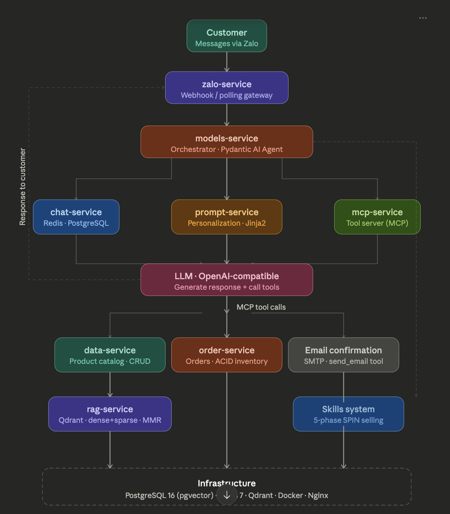

<a id="readme-top"></a>

**TRỢ LÝ BÁN HÀNG AI — BÁN HÀNG NHƯ NGƯỜI THẬT — TRÊN ZALO**

Chatbot AI đa dịch vụ sống trong **Zalo** — ứng dụng nhắn tin số 1 Việt Nam.<br />
Nhớ bạn là ai, khám phá bạn cần gì, và dẫn dắt bạn hoàn thành đơn hàng<br />
bằng phương pháp **SPIN Selling** — từ "xin chào" đến xác nhận đơn — qua hội thoại tự nhiên.

[Xem tài liệu](https://github.com/Ekanara/Dairy_Retail_Zalo_Bot) · [Báo lỗi](https://github.com/Ekanara/Dairy_Retail_Zalo_Bot/issues/new?labels=bug&template=bug-report---.md) · [Đề xuất tính năng](https://github.com/Ekanara/Dairy_Retail_Zalo_Bot/issues/new?labels=enhancement&template=feature-request---.md)

> 🌐 **English README:** [README.md](README.md)

---

## Ý tưởng

Hầu hết chatbot thương mại điện tử đều dump danh sách sản phẩm ngay khi bạn nói "xin chào". Đó là công cụ tìm kiếm gắn bong bóng chat — không phải bán hàng.

**Dairy AI** triển khai **SPIN Selling** dưới dạng AI agent. Bot trước tiên *hiểu bạn là ai*, rồi *khám phá bạn thực sự cần gì*, rồi *gợi ý đúng sản phẩm*, và chỉ khi đó mới *chốt đơn*. Nếu bạn nói "không", bot xử lý phản đối như nhân viên được đào tạo bài bản (tối đa 3 lần, sau đó kết thúc lịch sự).

Mỗi cuộc trò chuyện cảm giác như đang nói chuyện với người bạn am hiểu — không phải robot.

---

## Điểm nổi bật

- **[Bán hàng như người thật](#spin-selling--phương-pháp-bán-hàng-trong-ai)** — Quy trình 5 giai đoạn (Mở đầu → Khám phá → Tư vấn → Xử lý phản đối → Chốt đơn) theo SPIN Selling
- **[Nhớ từng khách hàng](#bộ-nhớ--ngắn-hạn-và-dài-hạn)** — Bộ nhớ per-user phát triển theo từng cuộc trò chuyện: tên, sở thích, tình trạng sức khoẻ, lịch sử mua
- **[Một prompt, nhiều cá tính](#kiến-trúc-prompt--tại-sao-mỗi-cuộc-trò-chuyện-lại-khác-nhau)** — Kiến trúc prompt dạng module lưu trong PostgreSQL, lắp ghép per-customer theo thời gian thực
- **[Tìm kiếm thông minh](#mcp-tools--ai-có-thể-làm-gì)** — Hybrid search kết hợp full-text keyword + semantic vector similarity (RAG)
- **[Đặt hàng từ đầu đến cuối](#mcp-tools--ai-có-thể-làm-gì)** — Từ "cho em lấy một hộp" đến kiểm tra tồn kho, giao dịch ACID, email xác nhận — tất cả trong chat
- **[AI agent gọi tool](#mcp-tools--ai-có-thể-làm-gì)** — Xây trên Model Context Protocol (MCP), AI tự quyết định *khi nào* tìm kiếm, cập nhật hồ sơ, hay tạo đơn
- **[Hoàn toàn async](#các-dịch-vụ--vai-trò-từng-phần)** — Tám FastAPI microservice, tất cả I/O non-blocking

---

## Kiến trúc



<br />

Orchestrator (`models-service`) thực hiện bốn việc mỗi khi có tin nhắn:

1. **Hỏi `chat-service`** để lấy lịch sử hội thoại — từ Redis cache được PostgreSQL backup
2. **Hỏi `prompt-service`** để lấy system prompt cá nhân hoá — lắp ghép từ các module per-user
3. **Kết nối `mcp-service`** để AI có thể gọi tools (tìm sản phẩm, kiểm tra tồn kho, tạo đơn, gửi email)
4. **Gửi tất cả lên LLM** và trả phản hồi về cho khách qua Zalo

---

## Cách hoạt động

```
Khách hàng               Dairy AI
   │
   │  "Chào shop!"
   ├──────────────────▶  Zalo webhook nhận tin nhắn
   │                          │
   │                          ▼
   │                    models-service (Orchestrator)
   │                          │
   │           ┌──────────────┼──────────────────┐
   │           │              │                   │
   │           ▼              ▼                   ▼
   │     chat-service   prompt-service       mcp-service
   │     "Lịch sử hội   "Khách này là ai?    "AI cần dùng
   │      thoại —        Cá tính gì?"         tool nào?"
   │      Redis+PG            │                   │
   │           │              │                   │
   │           └──────────────┴──────────────┬────┘
   │                                         │
   │                                         ▼
   │                                   AI sinh phản hồi
   │                                   (đúng tone, đúng
   │                                    kiến thức, đúng tool)
   │  "Dạ em recommend
   │   Ensure Gold cho                       │
   │   ba anh/chị ạ! 😊"                    │
   │◀────────────────────────────────────────┘
```

---

## Khái niệm cốt lõi

### Kiến trúc Prompt — Tại sao mỗi cuộc trò chuyện lại khác nhau

Hầu hết chatbot dùng một system prompt cho tất cả mọi người. Dairy AI xây **prompt riêng cho từng khách** bằng cách kết hợp sáu module tại thời điểm xử lý:

```
┌─────────────────────────────────────────────────────┐
│              system_prompt.md (Jinja2)               │
│                                                      │
│   ┌──────────┐  ┌──────────┐  ┌────────────────┐   │
│   │ IDENTITY │  │   SOUL   │  │      USER      │   │
│   │ "Em là   │  │ Ấm áp,   │  │ Nguyễn Văn A,  │   │
│   │  tư vấn  │  │ đồng cảm,│  │ 65 tuổi, tiểu  │   │
│   │  viên    │  │ không    │  │ đường, thích   │   │
│   │  Abbott" │  │ ép mua   │  │ Ensure Gold    │   │
│   └──────────┘  └──────────┘  └────────────────┘   │
│                                                      │
│   ┌──────────┐  ┌──────────┐  ┌────────────────┐   │
│   │  AGENTS  │  │  TOOLS   │  │     MEMORY     │   │
│   │ Quy tắc  │  │ Tool MCP │  │ "Lần trước,    │   │
│   │ an toàn  │  │ theo giai│  │  khách nhạy    │   │
│   │ & hành xử│  │ đoạn     │  │  cảm về giá"   │   │
│   └──────────┘  └──────────┘  └────────────────┘   │
└─────────────────────────────────────────────────────┘
```

| Thành phần | Kiểm soát gì | Ví dụ |
|:-----------|:-------------|:------|
| **IDENTITY** | Tên bot, tone, giới hạn tính cách | "Xưng *em*, gọi khách *anh/chị*" |
| **SOUL** | Cá tính cảm xúc và quy tắc đồng cảm | "Hỏi trước, tư vấn sau — không dump danh sách sản phẩm" |
| **USER** | Hồ sơ khách hàng phát triển theo từng lượt | Tuổi, ghi chú sức khoẻ, sở thích, phản đối cũ |
| **AGENTS** | Quy tắc hành vi và an toàn | "Không tìm sản phẩm trước giai đoạn Khám phá" |
| **TOOLS** | MCP tool nào được dùng theo từng giai đoạn | Tool tìm kiếm chỉ mở trong giai đoạn Tư vấn |
| **MEMORY** | Nhận diện pattern dài hạn per-customer | "Khách này phản hồi tốt với framing lợi ích sức khoẻ" |

Mỗi module được lưu **per-user trong PostgreSQL** và render qua Jinja2 tại thời điểm xử lý. Khi khách chia sẻ thông tin mới, AI cập nhật hồ sơ ngay lập tức qua tool `edit_personal_profile`.

---

### Skills — Kịch bản bán hàng của AI

Hành vi của AI được dẫn dắt bởi **hệ thống skills** — các resource markdown được load từng giai đoạn một qua tool `read_skill_resource`:

```
models-service/skills/sales-conversion/
├── SKILL.md              # Manifest: các giai đoạn, quy tắc vàng, ràng buộc thực thi
└── resources/
    ├── 01-opening.md     # Giai đoạn 1: chào hỏi & xây thiện cảm
    ├── 02-discovery.md   # Giai đoạn 2: SPIN questions — đối tượng, tuổi, mục tiêu sức khoẻ
    ├── 03-support.md     # Giai đoạn 3: gợi ý sản phẩm, assumptive close
    ├── 04-objection-handling.md  # Giai đoạn 4: thấu hiểu → làm rõ → thỏa mãn (tối đa 3 lần)
    └── 05-closing.md     # Giai đoạn 5: thu thập thông tin đơn, xác nhận, gửi email
```

**Ràng buộc quan trọng**: chỉ resource của giai đoạn hiện tại được load mỗi lượt. AI không bao giờ thấy toàn bộ kịch bản cùng lúc — nó đọc từng bước một tiếp theo, đúng như nhân viên bán hàng thực sự đang follow một script.

---

### SPIN Selling — Phương pháp bán hàng trong AI

```
 ┌───────────┐     ┌───────────┐     ┌───────────┐     ┌───────────┐     ┌───────────┐
 │  Mở đầu   │────▶│ Khám phá  │────▶│  Tư vấn   │────▶│ Xử lý     │────▶│  Chốt đơn │
 │           │     │           │     │           │     │ phản đối  │     │           │
 │ Chào hỏi  │     │ Hỏi về    │     │ Gợi ý SP  │     │ Thấu hiểu │     │ Thu thập  │
 │ & xây     │     │ đối tượng,│     │ & giải    │     │ → Làm rõ  │     │ thông tin │
 │ thiện cảm │     │ nhu cầu,  │     │ thích lợi │     │ → Thỏa    │     │ & xác nhận│
 │           │     │ sức khoẻ  │     │ ích       │     │ mãn (3 lần)│    │ đơn       │
 └───────────┘     └───────────┘     └───────────┘     └───────────┘     └───────────┘
```

AI theo dõi giai đoạn bằng state machine. Sẽ không tìm sản phẩm trong lúc Mở đầu. Sẽ không cố chốt đơn trong lúc Khám phá. Mỗi giai đoạn có quy tắc hội thoại, tone và tool riêng.

**Quy tắc quan trọng**: AI không bao giờ hỏi "Bạn có muốn mua không?". Thay vào đó, dùng **assumptive closing**: "Anh/chị lấy gói 850g hay 400g dùng thử ạ?" — dẫn dắt về một lựa chọn, không phải câu hỏi có/không.

---

### MCP Tools — AI có thể làm gì

| Tool | Thời điểm | Chức năng |
|:-----|:----------|:----------|
| `search_keyword` | Giai đoạn Tư vấn | Tìm kiếm toàn văn trong danh mục |
| `search_by_age` | Giai đoạn Tư vấn | Gợi ý sản phẩm theo độ tuổi |
| `rag_search` | Giai đoạn Tư vấn | Hybrid dense+sparse vector search (Qdrant + TEI reranker + MMR) |
| `view_personal_profile` | Bất kỳ | Xem hồ sơ & sở thích khách hàng |
| `edit_personal_profile` | Bất kỳ | Cập nhật thông tin khi khách chia sẻ |
| `read_skill_resource` | Mỗi lượt | Load hướng dẫn bán hàng cho giai đoạn hiện tại |
| `create_order` | Giai đoạn Chốt | Đặt hàng với kiểm tra tồn kho ACID |
| `send_email` | Giai đoạn Chốt | Gửi email xác nhận đơn hàng |

Tool tìm kiếm được **kiểm soát** — chỉ kích hoạt trong giai đoạn Tư vấn. Trong Mở đầu và Khám phá, AI tập trung hoàn toàn vào xây dựng thiện cảm và hiểu nhu cầu.

---

### Các dịch vụ — Vai trò từng phần

| Dịch vụ | Vai trò |
|:--------|:--------|
| **zalo-service** | Cổng vào. Nhận tin nhắn Zalo qua webhook hoặc polling, chuyển đến orchestrator |
| **models-service** | Bộ não. Chạy AgentScope ReActAgent, load sales skills, quản lý MCP tool calls |
| **chat-service** | Bộ nhớ đệm. Lưu tin nhắn vào PostgreSQL, phục vụ từ Redis ZSET cache — đọc dưới 5ms |
| **prompt-service** | Engine cá tính. Các module prompt per-user trong PostgreSQL, lắp ghép qua Jinja2 |
| **mcp-service** | Đôi tay. Tất cả tool AI có thể gọi — tìm kiếm, quản lý hồ sơ, đặt hàng, email |
| **rag-service** | Engine tri thức. Hybrid vector search qua Qdrant với RRF + MMR |
| **data-service** | Danh mục. Product CRUD, import CSV, full-text search |
| **order-service** | Quầy thu ngân. Quản lý vòng đời đơn hàng với giao dịch tồn kho ACID |

Mỗi service có cùng cấu trúc:

```
<service>/
├── main.py              # FastAPI entrypoint
├── requirements.txt     # Dependencies riêng biệt
├── .env.example         # Template môi trường
└── app/
    ├── api/             # Route handlers
    ├── services/        # Business logic
    ├── repositories/    # Data access layer
    ├── db/              # SQLAlchemy models
    └── core/            # Config & logging
```

---

### Bộ nhớ — Ngắn hạn và dài hạn

- **Ngắn hạn** (`chat-service`): mỗi tin nhắn trong PostgreSQL, cache trong Redis ZSET. Dưới 5ms khi có cache, ~20–50ms khi miss.
- **Dài hạn** (PostgreSQL qua `prompt-service`): hồ sơ khách hàng — tên, tuổi, tình trạng sức khoẻ, sản phẩm ưa thích, pattern phản đối — tồn tại qua các cuộc trò chuyện.

Khi khách nói "Ba em bị tiểu đường", AI gọi `edit_personal_profile` để lưu ngay. Những ngày sau, AI đã biết sẵn.

---

## Công nghệ

| Tầng | Công nghệ |
|:-----|:----------|
| **Ngôn ngữ** | Python 3.11, async toàn bộ |
| **Framework** | FastAPI (8 microservices) |
| **AI Agent** | AgentScope (ReActAgent) + Model Context Protocol (MCP) |
| **LLM** | OpenAI-compatible API (GPT, Azure, bất kỳ endpoint nào) |
| **Database** | PostgreSQL 16 với pgvector |
| **Cache** | Redis 7 (ZSET cho lịch sử chat) |
| **Vector Search** | Qdrant + TEI Reranker + MMR |
| **Templating** | Jinja2 (lắp ghép prompt per-user) |
| **Infra** | Docker Compose, Nginx, Alembic |
| **Kênh** | Zalo OA Bot API |

[![Python][Python-shield]][Python-url]
[![FastAPI][FastAPI-shield]][FastAPI-url]
[![PostgreSQL][PostgreSQL-shield]][PostgreSQL-url]
[![Redis][Redis-shield]][Redis-url]
[![Docker][Docker-shield]][Docker-url]
[![Pydantic][Pydantic-shield]][Pydantic-url]
[![OpenAI][OpenAI-shield]][OpenAI-url]
[![Jinja2][Jinja2-shield]][Jinja2-url]
[![Nginx][Nginx-shield]][Nginx-url]

---

## Bắt đầu

### Yêu cầu

- **Python 3.11+**
- **Docker & Docker Compose**
- **Zalo OA Bot Token** — [Zalo Developers](https://developers.zalo.me)
- **OpenAI-compatible API Key** — OpenAI, Azure OpenAI, hoặc bất kỳ endpoint tương thích nào
- **Ollama** _(tuỳ chọn)_ — cho embedding local

### Docker (full stack)

```bash
git clone https://github.com/Ekanara/Dairy_Retail_Zalo_Bot.git
cd Dairy_Retail_Zalo_Bot/infrastructure

make setup       # copy .env, build images, chạy migrations, import data
make up          # khởi động tất cả services
make health      # kiểm tra tất cả đang chạy
```

### Phát triển local

```bash
git clone https://github.com/Ekanara/Dairy_Retail_Zalo_Bot.git
cd Dairy_Retail_Zalo_Bot

cd infrastructure && make dev-infra   # chỉ khởi động PostgreSQL + Redis
cd ..
./scripts/chat-up.sh                  # khởi động tất cả services locally
./scripts/chat-status.sh              # kiểm tra trạng thái
./scripts/chat-down.sh                # dừng tất cả
```

### Phát triển từng service

```bash
cd models-service                     # hoặc bất kỳ service nào
python -m venv .venv && source .venv/bin/activate
pip install -r requirements.txt
cp .env.example .env                  # điền API keys
uvicorn main:app --reload --port 8000
```

Cổng dịch vụ: `models=8000` · `prompt=8001` · `data=8002` · `order=8003` · `mcp=8004` · `zalo=8080`

---

## Lệnh thường dùng

```bash
# Infrastructure (từ infrastructure/)
make up / down / build / logs / ps    # quản lý container lifecycle
make restart-mcp-service              # restart một service cụ thể
make psql / redis-cli                 # kết nối database
make migrate                          # chạy tất cả Alembic migrations
make import                           # import dữ liệu sản phẩm CSV
make health                           # kiểm tra tất cả services

# Scripts local
./scripts/chat-up.sh                  # khởi động tất cả services locally
./scripts/chat-down.sh                # dừng tất cả services
./scripts/chat-status.sh              # kiểm tra trạng thái
./scripts/chat-logs.sh                # xem log tổng hợp
```

---

## Cấu hình

Mỗi service đọc từ file `.env` riêng. Xem `.env.example` của từng service để biết đầy đủ:

| Service | Biến quan trọng |
|:--------|:----------------|
| **models-service** | `MODEL_NAME`, `API_KEY`, `BASE_URL`, `PROMPT_SERVICE_URL`, `MCP_SERVICE_URL`, `CHAT_SERVICE_URL` |
| **zalo-service** | `ZALO_BOT_TOKEN`, `MODEL_SERVICE_URL`, `WEBHOOK_SECRET_TOKEN` |
| **mcp-service** | `DATABASE_URL`, `ORDER_SERVICE_URL`, `SMTP_HOST`, `RAG_SERVICE_URL` |
| **chat-service** | `DATABASE_URL`, `REDIS_URL`, `CACHE_TTL`, `DEFAULT_TOP_K` |
| **rag-service** | `GEMINI_API_KEY`, `QDRANT_HOST`, `QDRANT_PORT`, `TEI_RERANKER_URL` |
| **Infrastructure** | `POSTGRES_USER`, `POSTGRES_PASSWORD`, `POSTGRES_DB`, `REDIS_PORT` |

---

## Lộ trình phát triển

- [x] Kiến trúc microservices đa dịch vụ (8 services)
- [x] AgentScope ReActAgent với MCP tool calling
- [x] Hệ thống prompt cá nhân hoá per-user
- [x] Kịch bản bán hàng dạng skills (sales-conversion skill)
- [x] RAG hybrid search (Qdrant + TEI reranker + MMR)
- [x] Vòng đời đơn hàng đầy đủ với quản lý tồn kho
- [x] chat-service riêng biệt (Redis+PG lịch sử hội thoại)
- [x] Pre-processing tin nhắn thông minh (phát hiện health-answer, "muốn tất cả")
- [x] Phân loại intent theo ngữ cảnh với hidden hints
- [ ] Hỗ trợ đa ngôn ngữ (Tiếng Anh, Tiếng Việt)
- [ ] Dashboard admin cho analytics và monitoring
- [ ] A/B testing cho các chiến lược prompt
- [ ] Hỗ trợ đa kênh (Facebook Messenger, Telegram)
- [ ] Xử lý tin nhắn thoại

Xem [open issues](https://github.com/Ekanara/Dairy_Retail_Zalo_Bot/issues) để biết danh sách đầy đủ.

---

## Đóng góp

Mọi đóng góp đều **được trân trọng**. Fork repo và tạo pull request — hoặc mở issue với tag "enhancement".

1. Fork dự án
2. Tạo Feature Branch (`git checkout -b feat/amazing-feature`)
3. Commit thay đổi (`git commit -m 'feat: add amazing feature'`)
4. Push lên Branch (`git push origin feat/amazing-feature`)
5. Mở Pull Request

Chúng tôi theo [Conventional Commits](https://www.conventionalcommits.org/) — dùng prefix `feat:`, `fix:`, `chore:`, `docs:`.

---

## Giấy phép

Phân phối theo **GNU General Public License v3.0**. Xem file `LICENSE` để biết thêm.

## Liên hệ

**Dairy AI** — [Project Link](https://github.com/Ekanara/Dairy_Retail_Zalo_Bot)

## Lời cảm ơn

- [FastAPI](https://fastapi.tiangolo.com/) — Web framework async hiệu năng cao
- [AgentScope](https://github.com/modelscope/agentscope) — Multi-agent framework với ReActAgent và MCP support
- [FastMCP](https://github.com/jlowin/fastmcp) — Model Context Protocol server
- [pgvector](https://github.com/pgvector/pgvector) — Vector similarity search cho PostgreSQL
- [python-zalo-bot](https://pypi.org/project/python-zalo-bot/) — Zalo OA API client
- [Ollama](https://ollama.com/) — Local LLM và embedding inference

<p align="right">(<a href="#readme-top">lên đầu trang</a>)</p>

<!-- MARKDOWN LINKS & IMAGES -->

<!-- TECH STACK BADGES -->
[Python-shield]: https://img.shields.io/badge/Python-3.11-3776AB?style=for-the-badge&logo=python&logoColor=white
[Python-url]: https://python.org
[FastAPI-shield]: https://img.shields.io/badge/FastAPI-0.115-009688?style=for-the-badge&logo=fastapi&logoColor=white
[FastAPI-url]: https://fastapi.tiangolo.com
[PostgreSQL-shield]: https://img.shields.io/badge/PostgreSQL-16-4169E1?style=for-the-badge&logo=postgresql&logoColor=white
[PostgreSQL-url]: https://postgresql.org
[Redis-shield]: https://img.shields.io/badge/Redis-7-DC382D?style=for-the-badge&logo=redis&logoColor=white
[Redis-url]: https://redis.io
[Docker-shield]: https://img.shields.io/badge/Docker-2496ED?style=for-the-badge&logo=docker&logoColor=white
[Docker-url]: https://docker.com
[Pydantic-shield]: https://img.shields.io/badge/AgentScope-FF6B35?style=for-the-badge&logo=python&logoColor=white
[Pydantic-url]: https://github.com/modelscope/agentscope
[OpenAI-shield]: https://img.shields.io/badge/OpenAI_SDK-412991?style=for-the-badge&logo=openai&logoColor=white
[OpenAI-url]: https://platform.openai.com
[Jinja2-shield]: https://img.shields.io/badge/Jinja2-B41717?style=for-the-badge&logo=jinja&logoColor=white
[Jinja2-url]: https://jinja.palletsprojects.com
[Nginx-shield]: https://img.shields.io/badge/Nginx-009639?style=for-the-badge&logo=nginx&logoColor=white
[Nginx-url]: https://nginx.org
